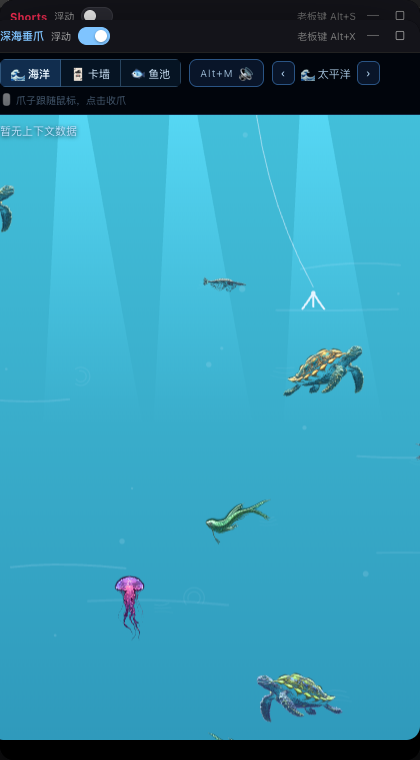
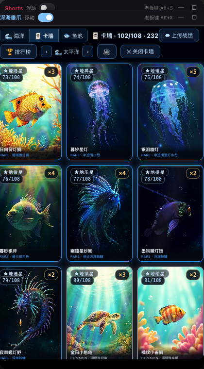
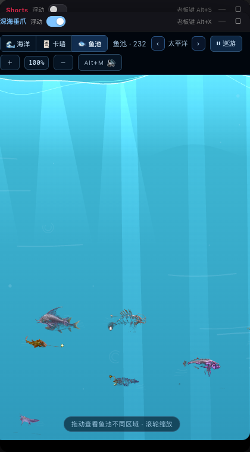

# dsh-deepsea · Deep-Sea Slacking

中文 | [English](README_EN.md)

**Turn your conversation context into a deep-sea slack-off game** — a DeepSeek Harness (DSH) floating-window game:
the longer your session context, the deeper your hand sinks; touch a creature from that depth and roll the
server's dice to mint a MiniMax-generated holographic collectible card.

## Preview

| Ocean | Card wall | Fish pond |
|:---:|:---:|:---:|
|  |  |  |

```sh
dsh plugin --profile web add npm:dsh-deepsea          # npm (recommended)
dsh plugin --profile web add github:imkingjh999/dsh-deepsea   # GitHub
# Local dev: add link:<path-to-this-repo> to the profile dependencies
```

> Personal entertainment. Everything runs through your local DSH host + your own MiniMax API key;
> battle uploads are opt-in (Ed25519 signed, off by default).

## Gameplay

| Mechanic | Detail |
|---|---|
| **Depth = occupancy** | Hook rides `contextPressure` (projectedTokens / contextWindow); HUD shows depth % + tokens |
| **Four zones × five oceans** | Sunlit → Twilight → Midnight → Abyss, four viewports deep, camera follows the hook; Pacific / Atlantic / Indian / Arctic / Southern switch on demand — each with its own fauna, water tint and BGM |
| **Manual touch, guaranteed contact** | Your hand follows the pointer; click to reach. Overlap + click **always connects** — whether it becomes a card is the server's dice (1/5; 1/2 during a new diver's first 5 minutes), and the post-win 5-minute cooldown is server-adjudicated too |
| **Dice theater** | Each catch plays a hash-tail roll theater (fast tumble → settle → locked result): win mints, lose wriggles free |
| **Water Margin 108 set** | The 108 Stars as deep-sea creatures: top-10 天罡 Legendary, 11-36 Epic, 地煞 Rare/Common; star-rank badges on every card |
| **Holographic cards** | M3 lore + image-01 art; Python bakes diffraction/mask layers; browser composites the foil with pointer tilt; SSR gold-foil glow, UR rainbow sweep |
| **Card wall** | In-window grid (scrolls vertically); hover plays the entrance; click for the enlarged card + story |
| **Fish pond** | Every catch swims in a multi-screen pond world: cruise, 0.5–2.5× pointer-anchored zoom, dual-sine surface light, MiniMax-painted island & boat silhouettes |
| **On-chain identity** | Pre-minted cards are hash-chain blocks (`SHA256(prev|kind|payload)`); catches append blocks; `/api/chain/verify` recomputes |
| **Tamper hardening** | Mint blocks record all three card-layer sha256s; `verify-assets` fetches and compares |
| **Floating shell** | Float (drag / corner resize / dock **flush-right** via toggle or drag-to-edge), stick rail, minimize; the ocean never unmounts |
| **Per-window boss key** | Auto-assigned (this window **Alt+X**; Shorts keeps Alt+S); title bar shows live combo; Alt+M mute |
| **Battle cloud (opt-in)** | Cloudflare Worker + D1 keep the server-adjudicated ledger (`pow_wins`) — dice outcomes and mints are decided server-side, Ed25519 only proves identity; **link GitHub** to appear on the global leaderboard with your username + avatar; self-reported stats are never trusted |
| **Pre-minted pool** | `scripts/mint.ts` batch-mints (MiniMax art + holo bake → R2 → D1); all media served from R2; each release window (10–20 min) rotates one card onto the table |

## Configuration (optional)

In the profile's `cordis.patch.yml`:

```yaml
- id: deepsea
  config:
    minimaxApiKeyEnv: MINIMAX_API_KEY   # key chain: this env → MINIMAX_API_KEY → VISION_API_KEY → ~/.mmx/config.json
    minimaxModel: MiniMax-M3            # lore model (thinking auto-disabled)
    minimaxImageModel: image-01         # card art model
    pythonBin: python3                  # needs PIL + numpy (decoration baking)
    dataDir: ''                         # card store (default ~/.dsh/deepsea)
    workerUrl: https://deepsea.openclawd.qzz.io
```

## Architecture

- **Host** (`src/index.ts`): `POST /deepsea/api/catch` (rarity roll → M3 lore → image-01 art
  → `scripts/holo.py` bakes layers → stored), `GET /deepsea/api/cards`, `POST /deepsea/api/upload`
  (Ed25519 signing relay), `GET /deepsea/assets/*`. Every route sits behind the browser-trust fence.
- **Client** (`src/client/`): `shell.tsx` floating shell; `ocean.tsx` canvas engine
  (four-viewport water column, camera-follows-hook descent, procedural creatures, catch animation);
  `cards.tsx` holo card + wall + modal; `depth.ts` pure depth vocabulary.
  Reads `contextPressure` / `running` via `ctx.sessions` (`sessions.list` subscribed once per mount,
  rebinds only when the session changes).
- **Cloud** (`cloudflare/`): Worker + D1 — the server-adjudicated ledger (`pow_wins`), release windows,
  GitHub identity links; PoW dice adjudication, Ed25519 verification, win-only 5-minute cooldown and the
  rookie 5-minute luck window; one-command `wrangler deploy`.

## Development

```sh
pnpm install && pnpm run build
pnpm test          # vitest: depth mapping / rarity distribution / lore parsing / card store / bundle smoke
node tests/smoke-client.mjs
# cloudflare/
wrangler d1 execute deepsea-leaderboard --remote --file=schema.sql
wrangler deploy
```

## License

MIT
